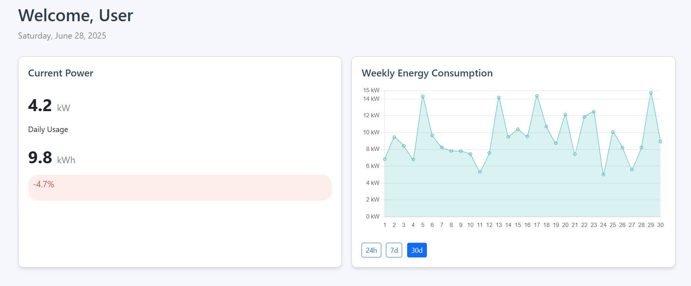

# ECo_meter

This my first full stack project.
<br/>
Author-Aswin Harikrishnan(MEC Kochi)

##ECo_meter
DASHBOARD demo link : "http://ec0-meter-gt2c.onrender.com/"

# Smart Energy Meter Dashboard

<div align="center">
  
   
  <br>
  <em>Dashboard with JavaScript integration</em>
</div>

A responsive web-based dashboard for monitoring and visualizing energy consumption in real-time.

## Features

- **Real-time Monitoring**:
  - Current power consumption (kW)
  - Daily energy usage (kWh)
  - Monthly consumption statistics
  - Estimated electricity costs

- **Interactive Visualizations**:
  - Time-series chart of energy consumption (24h/7d/30d views)
  - Responsive design works on all devices

- **Additional Features**:
  - Carbon footprint tracking
  - Energy efficiency leaderboard
  - Automatic date display
  - Real-time data updates (simulated)

## Technologies Used

- **Frontend**:
  - HTML5, CSS3, JavaScript
  - [Chart.js](https://www.chartjs.org/) for data visualization
  - [Bootstrap 5](https://getbootstrap.com/) for responsive layout
  - [Font Awesome](https://fontawesome.com/) for icons

## Installation

1. Clone the repository:
   ```bash
   git clone https://github.com/aswinharikrishnan/smart-energy-dashboard.git
